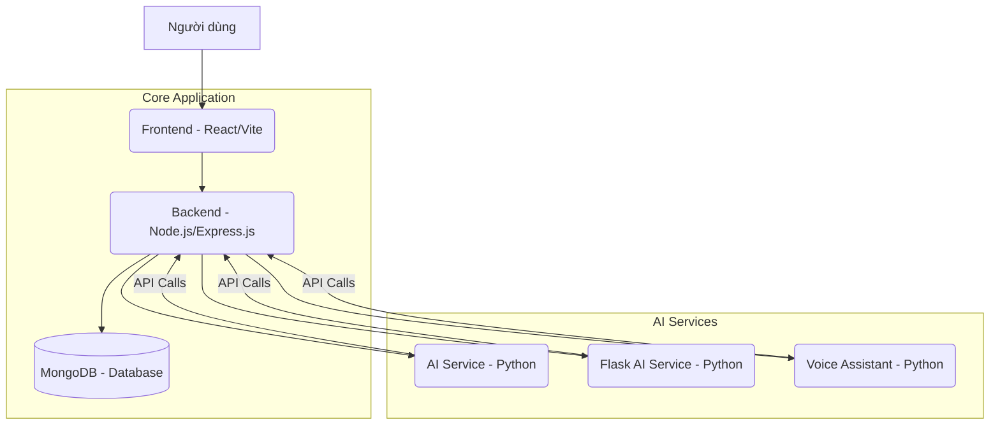

# Kiến trúc Hệ thống Dự án Eng_learn

Chào bạn, tôi sẽ trình bày về kiến trúc hệ thống của dự án Eng_learn, cách chúng tôi thiết kế cơ sở dữ liệu, xử lý các yêu cầu, và tiềm năng Dockerize dự án.

## 1. Tổng quan Kiến trúc Hệ thống: Kiến trúc Phân tán (Distributed System)

Dự án Eng_learn được thiết kế theo kiến trúc **phân tán (Distributed System)**. Điều này có nghĩa là hệ thống được chia thành nhiều thành phần (services) nhỏ, độc lập, mỗi thành phần có một vai trò cụ thể và có thể chạy riêng rẽ. Các thành phần này giao tiếp với nhau thông qua mạng (thường là qua các API).

**Lợi ích của kiến trúc phân tán:**
*   **Khả năng mở rộng (Scalability):** Mỗi dịch vụ có thể được mở rộng độc lập dựa trên nhu cầu tải. Ví dụ, nếu dịch vụ AI cần nhiều tài nguyên hơn, chúng tôi có thể mở rộng riêng dịch vụ đó mà không ảnh hưởng đến các phần khác.
*   **Độc lập phát triển và triển khai:** Các nhóm khác nhau có thể làm việc trên các dịch vụ khác nhau mà không bị phụ thuộc quá nhiều vào nhau.
*   **Linh hoạt công nghệ:** Mỗi dịch vụ có thể sử dụng công nghệ (ngôn ngữ, framework) phù hợp nhất với nhiệm vụ của nó.

### Minh họa Kiến trúc:



*(Lưu ý: Nếu trình duyệt không hiển thị Mermaid, đây là minh họa đơn giản hơn:)*

```
+------------------+
|     Người dùng  |
+--------+---------+
         |
         v
+------------------+
|     Frontend     |
|   (React/Vite)   |
+--------+---------+
         |
         v
+------------------+
|      Backend     |
| (Node.js/Express)|
+--------+---------+
         |    |
         |    +----------------------------------------------------------------+
         v    v                                                                |
+------------------+  +------------------+  +------------------+  +------------------+
|     MongoDB      |  |    AI Service    |  | Flask AI Service |  | Voice Assistant  |
|    (Database)    |  |     (Python)     |  |     (Python)     |  |     (Python)     |
+------------------+  +------------------+  +------------------+  +------------------+
```

## 2. Các Thành phần chính của Hệ thống:

*   **Frontend (Thư mục `frontend/`)**:
    *   Được xây dựng bằng **React** và **Vite**. Đây là giao diện người dùng (UI) mà người dùng tương tác trực tiếp.
    *   Nhiệm vụ: Hiển thị thông tin, thu thập dữ liệu từ người dùng, và gửi các yêu cầu (HTTP requests) đến các dịch vụ backend.

*   **Backend (Thư mục `backend/`)**:
    *   Được xây dựng bằng **Node.js** và framework **Express.js**.
    *   Đây là trái tim của ứng dụng, xử lý các logic nghiệp vụ chính, quản lý người dùng (đăng ký, đăng nhập, xác thực), và tương tác với cơ sở dữ liệu.
    *   **Thiết kế DB**: Chúng tôi sử dụng **MongoDB** làm cơ sở dữ liệu NoSQL. MongoDB lưu trữ dữ liệu dưới dạng các tài liệu (documents) linh hoạt, phù hợp với dữ liệu phi cấu trúc và cho phép thay đổi schema dễ dàng.
        *   Các `model` (như `userModel`, `calenderModel`, `examModel`) định nghĩa cấu trúc dữ liệu và cách tương tác với MongoDB.
    *   **Xử lý Request**: Tuân theo kiến trúc **phân lớp (Layered Architecture)**:
        1.  **Routing**: Định tuyến các HTTP request đến đúng Controller.
        2.  **Middleware**: Xử lý các tác vụ chung như xác thực (`protectRoute.js`), ghi log, trước khi request đến logic chính.
        3.  **Controller**: Chứa logic nghiệp vụ, xử lý dữ liệu đầu vào, và gọi đến Model để tương tác với DB.
        4.  **Model**: Giao tiếp trực tiếp với MongoDB để thực hiện các thao tác CRUD (Create, Read, Update, Delete).

*   **AI Service (Thư mục `AIService/`)**:
    *   Một dịch vụ độc lập được viết bằng **Python**.
    *   Chuyên xử lý các tác vụ AI chung như nhận diện giọng nói, xử lý các mô hình ONNX (`Kokoro-82M-ONNX`).
    *   Cung cấp API để backend hoặc các dịch vụ khác gọi đến khi cần các chức năng AI chuyên biệt.

*   **Flask AI Service (Thư mục `flask/ai-pronunciation-trainer-main/`)**:
    *   Một dịch vụ AI độc lập khác, được xây dựng bằng **Python** và framework **Flask**.
    *   Tập trung vào chức năng huấn luyện phát âm.
    *   Cũng cung cấp API hoặc có thể có giao diện web riêng để tương tác.

*   **Voice Assistant (Thư mục `voiceAssistant/`)**:
    *   Một dịch vụ độc lập khác được viết bằng **Python**.
    *   Chuyên về các chức năng liên quan đến trợ lý giọng nói.

## 3. Tiềm năng Dockerize Dự án:

Hiện tại, dự án **chưa được Dockerize hoàn chỉnh**, nhưng kiến trúc phân tán của nó rất phù hợp để áp dụng **Docker (Containerization)** trong tương lai.

*   **Docker (Containerization)**: Là quá trình đóng gói một ứng dụng và tất cả các thành phần cần thiết để nó chạy (code, thư viện, môi trường) vào một đơn vị độc lập gọi là **container**. Container đảm bảo ứng dụng chạy nhất quán trên mọi môi trường.
*   **Kế hoạch Dockerize**: Chúng tôi sẽ tạo:
    *   **`Dockerfile` riêng cho từng service**: Backend (Node.js), Frontend (React), AIService (Python), Flask AI Service (Python), Voice Assistant (Python).
    *   Sử dụng **`docker-compose.yml`** để định nghĩa và điều phối tất cả các service này, bao gồm cả việc tích hợp **MongoDB** dưới dạng một container riêng.

**Lợi ích của việc Dockerize:**
*   **Tính di động (Portability):** Ứng dụng chạy nhất quán trên mọi môi trường (phát triển, thử nghiệm, sản phẩm).
*   **Cô lập (Isolation):** Mỗi service chạy trong container riêng, không ảnh hưởng đến các service khác.
*   **Triển khai dễ dàng:** Đơn giản hóa quá trình triển khai và quản lý ứng dụng, đặc biệt trong môi trường phân tán.

## 4. Tại sao lại chọn kiến trúc này?

Đối với một dự án có nhiều thành phần chuyên biệt như xử lý AI, quản lý người dùng, và giao diện người dùng, kiến trúc phân tán giúp chúng tôi:
*   **Quản lý độ phức tạp:** Chia nhỏ vấn đề lớn thành các phần nhỏ hơn, dễ quản lý hơn.
*   **Tối ưu hóa tài nguyên:** Mỗi dịch vụ có thể được tối ưu hóa và mở rộng độc lập.
*   **Phù hợp cho sự phát triển trong tương lai:** Dễ dàng thêm các tính năng hoặc dịch vụ mới mà không cần thay đổi toàn bộ hệ thống.

Tuy nhiên, chúng tôi cũng nhận thức được rằng kiến trúc này mang lại độ phức tạp cao hơn trong việc quản lý và vận hành so với một ứng dụng monolithic đơn giản. Do đó, việc áp dụng Docker và các công cụ quản lý container sẽ là bước tiếp theo quan trọng để tối ưu hóa quá trình này.

---